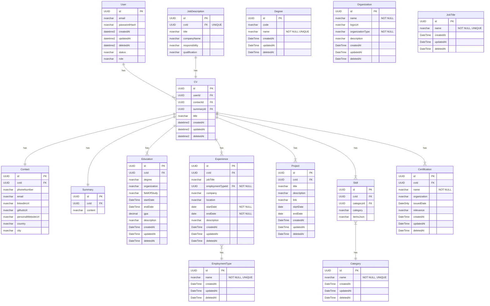

# Database Schema Refactoring Guidelines

## Current Schema Overview



## Refactoring Tasks

### 1. Foreign Key Removal Recommendations

#### 1.1 JobTitle Table
**Current State**: Standalone reference table for search suggestions
**Recommendation**:
- **Keep the `JobTitle` table** for search suggestions and autocomplete functionality
- **Remove any foreign key relationships** from domain tables (Experience, etc.) to JobTitle table
- Use JobTitle as a suggestion/lookup table only, not as a normalized reference

**Impact on Related Tables**:
- `Experience.jobTitle` - Keep as `nvarchar` (no foreign key constraint)
- JobTitle table serves as suggestion source for UI autocomplete
- No referential integrity constraints between Experience and JobTitle

#### 1.2 Organization Table
**Current State**: Standalone reference table for search suggestions
**Recommendation**:
- **Keep the `Organization` table** for search suggestions and autocomplete functionality
- **Remove any foreign key relationships** from domain tables to Organization table
- Use Organization as a suggestion/lookup table only

**Impact on Related Tables**:
- `Experience.company` - Keep as `nvarchar` (no foreign key constraint)
- `Education.organization` - Keep as `nvarchar` (no foreign key constraint)
- `Certification.organization` - Keep as `nvarchar` (no foreign key constraint)
- Organization table serves as suggestion source for UI autocomplete
- No referential integrity constraints between domain tables and Organization

#### 1.3 Degree Table
**Current State**: Standalone reference table for search suggestions
**Recommendation**:
- **Keep the `Degree` table** for search suggestions and autocomplete functionality
- **Remove any foreign key relationships** from domain tables to Degree table
- Use Degree as a suggestion/lookup table only

**Impact on Related Tables**:
- `Education.degree` - Keep as `nvarchar` (no foreign key constraint)
- Degree table serves as suggestion source for UI autocomplete
- No referential integrity constraints between Education and Degree tables

### 2. Column Updates and Renaming

#### 2.1 CV Table Structural Changes
**Current Issues**:
- `contactId FK` and `summaryId FK` create unnecessary complexity
- One-to-one relationships can be simplified

**Recommended Changes**:
```sql
-- Remove foreign key columns
ALTER TABLE CV DROP COLUMN contactId;
ALTER TABLE CV DROP COLUMN summaryId;
```

**Rationale**: Contact and Summary already have `cvId FK`, making the reverse foreign keys redundant.

#### 2.2 Skill Table Schema Optimization
**Current Issues**:
- Redundant `category` column when `categoryId FK` exists
- JSON storage in `itemsJson` may need better structure

**Recommended Changes**:
```sql
-- Remove redundant category column
ALTER TABLE Skill DROP COLUMN category;

-- Consider renaming for clarity
EXEC sp_rename 'Skill.itemsJson', 'skillItems', 'COLUMN';
```

#### 2.3 Date/DateTime Consistency
**Current Issues**:
- Mixed usage of `DateTime`, `datetime2`, `date`, and `DateOnly`

**Recommended Standardization**:
```sql
-- Standardize all date fields to appropriate types
-- For Education table
ALTER TABLE Education ALTER COLUMN startDate date;
ALTER TABLE Education ALTER COLUMN endDate date;

-- For timestamp fields, use datetime2 consistently
ALTER TABLE Education ALTER COLUMN createdAt datetime2;
ALTER TABLE Education ALTER COLUMN updatedAt datetime2;
ALTER TABLE Education ALTER COLUMN deletedAt datetime2;
```

### 3. Implementation Priority

#### Phase 1: Remove Foreign Key Constraints
1. Remove any existing foreign key constraints from domain tables to `JobTitle` table
2. Remove any existing foreign key constraints from domain tables to `Organization` table
3. Remove any existing foreign key constraints from domain tables to `Degree` table
4. Keep all three tables as standalone suggestion/lookup tables

#### Phase 2: CV Table Optimization
1. Remove `contactId` column from CV table
2. Remove `summaryId` column from CV table
3. Update any existing application code dependencies

#### Phase 3: Column Cleanup and Renaming
1. Remove redundant `category` column from Skill table
2. Rename `itemsJson` to `skillItems` in Skill table
3. Standardize date/datetime field types across all tables

#### Phase 4: Validation and Testing
1. Update Entity Framework models
2. Create and run database migration scripts
3. Update repository layer code
4. Run comprehensive tests

### 4. Migration Considerations

#### Pre-Migration Checklist
- [ ] Backup current database
- [ ] Identify all dependent code files
- [ ] Prepare rollback scripts
- [ ] Update Entity Framework configurations

#### Post-Migration Tasks
- [ ] Update API models and DTOs
- [ ] Modify service layer implementations
- [ ] Update unit and integration tests
- [ ] Verify data integrity

### 5. Risk Assessment

**Low Risk**:
- Removing foreign key constraints (JobTitle, Organization, Degree tables remain as lookup tables)
- Column renaming operations

**Medium Risk**:
- CV table structural changes (removing foreign keys)
- Date type standardization

**Mitigation Strategies**:
- Implement changes in development environment first
- Create comprehensive test coverage
- Plan gradual rollout with rollback capabilities
	